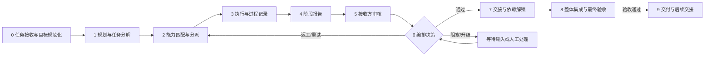

# 多 Agent 自主协作开发计划

> 文档状态：协作协议与实施基线 v1
>
> 原始记录日期：2026-09-30
>
> 最近实现对账：2026-10-02（以当前代码、迁移、测试和提交为准）
>
> 适用范围：synapforge 的单 Agent 工作台、多 Agent 协作生产、垂直工作流包、执行体通信、流程可视化与自动化推进。
>
> 上游决策：`docs/PRODUCT_STATUS_AND_REPOSITIONING_PLAN.md`、`docs/REPOSITIONING_IMPLEMENTATION_PLAN.md`。
>
> 相关协议：`docs/AGENT_EVENT_CONTRACT.md`、`docs/EVENT_ENVELOPE.md`、`docs/WORKFLOW_SCHEMA.md`、`docs/RECEIPT_FORMAT.md`。

---

## 1. 文档定位

这份文档记录本次三个会话并行开发所验证的自主 Agent 通信协作流程，并将其转化为 synapforge 后续的产品和工程基线。

本次实际流程已经证明了一个可行的 Level 1 协作原型：

```text
主 Agent 人工规划与分派
    ↓
多个执行 Agent 按边界并行工作
    ↓
执行 Agent 提交阶段成果与结构化报告
    ↓
其他 Agent 审核成果、确认口径和前置条件
    ↓
主 Agent 汇总、整合、复核并交付
```

当前平台已经有可运行的 Level 2 基础：工作流 schema v1、版本化运行、推进器 v1、两个内置工作流包、receipt 溯源、lease fencing 和真实双 Agent 回归基线均已交付；但主动运行时协作、统一决策协议、完整恢复和前端流程视图尚未形成长期运行闭环。因此，本计划的目标不是从零再造引擎，而是在既有实现上把以下闭环继续产品化：

```text
目标规范化
→ 任务分解
→ 能力匹配
→ 受约束派发
→ 执行与报告
→ 确定性验收
→ 审核与交接
→ 下游解锁
→ 失败重试或人工升级
→ 整体集成与最终验收
→ 正式交付与后续交接
```

### 1.1 不改变的产品边界

1. synapforge 仍然定位为 **Agent 协作生产平台**，数学建模是首个垂直工作流包，而不是平台唯一定位。
2. GitHub 继续承担仓库、分支、Pull Request 和代码协作；平台不复制 Git 产品。
3. 不新增第二套权限、审批或事件协议。已有 RLS、审批、`events/event_outbox`、Agent Protocol 和文件管理边界继续复用。
4. “自动”只表示受约束的调度和推进，不承诺无限制的无人值守完成。
5. 所有业务失败、阻塞、退回、等待审批和等待输入都必须如实呈现，不用静态进度或成功文案掩盖。

### 1.2 当前成熟度

| 等级 | 含义 | 当前状态 |
|---|---|---|
| Level 0 | 人工逐个调用 Agent，靠口头说明任务 | 已超出 |
| Level 1 | 主 Agent 人工拆解，多 Agent 并行，报告驱动交接 | **本次已验证** |
| Level 2 | 平台自动分派、验收、交接、重试和暂停 | 已有 schema/版本化运行、推进器 v1、内置包和部分 E2E；主动协作、统一状态迁移和完整闭环仍需补齐 |
| Level 3 | 可恢复自主生产，支持崩溃恢复、重规划、升级和最终交付 | 后续目标 |

---

## 2. 原始决策口径：阶段 0–9 协作流程

以下内容是本次协作流程的原始决策口径。后续实现可以优化接口和自动化程度，但不得改变其职责边界、证据纪律和状态含义。本文沿用讨论中的“九阶段”称呼，但正式编号采用阶段 0–9，共十个编号阶段：阶段 0 负责把任务带入系统并明确范围，阶段 8 负责整体集成与最终验收，阶段 9 负责正式交付与后续交接。产品界面、事件和 API 必须使用明确的数字编号，不能再把阶段 0 隐含为编号外的准备步骤。

### 阶段 0：任务接收与目标规范化

**目的**：把用户目标转换成可执行、可验收的项目目标。

- 输入：用户请求、项目背景、已有成果、产品约束、非目标和安全限制。
- 负责角色：主 Agent / Planner；必要时由项目负责人确认。
- 系统动作：建立或更新项目目标，记录范围、成功标准、非目标、风险和初始输入。
- 输出：`GoalSpec` 或等价的项目目标记录。
- 允许状态：`planned`；若目标信息不足，进入 `waiting` 或 `blocked_needs_user_input`。
- 失败出口：目标冲突、范围不明确、权限不足、缺少用户决策。
- 下一阶段触发：目标、边界和验收口径明确后，生成任务分解。

**不变量**：不能把一句自然语言请求直接当成“已批准的执行计划”。

### 阶段 1：规划与任务分解

**目的**：把目标拆成有依赖关系、有输出和有验收条件的任务节点。

- 输入：规范化目标、工作流版本、项目资源和约束。
- 负责角色：主 Agent / Orchestrator；工作流包提供默认节点和角色。
- 系统动作：生成任务 DAG，声明每个节点的输入、输出、能力、模式、交接、门禁、重试和人工介入点。
- 输出：任务节点、依赖边、角色绑定、GatePolicy、HandoffContract。
- 允许状态：节点初始为 `DRAFT` 或 `PENDING`，依赖满足后才可成为 `READY`。
- 失败出口：DAG 有环、引用不完整、工作流版本不存在、门禁语法不可判定。
- 下一阶段触发：任务图校验通过且至少有一个入口节点 `READY`。

**不变量**：工作流定义和一次运行状态分离；已发布工作流版本不可悄悄改变历史运行。

### 阶段 2：能力匹配与分派

**目的**：为 ready 节点选择有权执行且能力合适的 Agent 或人工接收方。

- 输入：`READY` 节点、依赖状态、能力要求、项目授权、Agent 在线状态、当前负载和预算。
- 负责角色：Orchestrator；Agent 只能接受或拒绝自己的派发。
- 系统动作：执行指定角色 → 能力匹配 → 上一角色连续性 → 可用候选 → 人工升级的确定性回退链；创建 lease/fencing 信息和幂等派发命令。
- 输出：`OrchestrationDecision`、派发命令、任务租约。
- 允许状态：`READY → LEASED`；命令重复投递不得产生第二个有效派发。
- 失败出口：没有可用 Agent、能力不足、授权过期、租约冲突、预算不足。
- 下一阶段触发：Agent 成功领取并开始执行。

**不变量**：调度器的“能力豁免”不能绕过平台权限和能力授权；调度建议不等于执行许可。

### 阶段 3：执行与过程记录

**目的**：Agent 按任务输入、工具权限和工作区边界执行，并持续产生可追溯过程。

- 输入：任务提示、已批准输入成果物、工作流上下文、工具权限、交接上下文。
- 负责角色：被分派的执行 Agent；平台负责记录事实。
- 系统动作：领取 lease、执行工具、产生过程事件、上传成果、生成 receipt、维持 heartbeat；发现信息缺口时可主动发起运行时信息请求；发现前提不成立、任务不可完成或原计划存在风险时，立即报告阻塞、可行性判断和 stop reason。
- 输出：Run、事件、工具 receipt、成果物、过程日志、运行时信息请求/回复、阶段报告草稿或诚实的不可行性报告。
- 允许状态：`LEASED → RUNNING → REPORTED`，也可能进入 `FAILED`、`BLOCKED`、`WAITING` 或 `CANCELLED`。
- 失败出口：执行异常、工具失败、权限拒绝、超时、预算触顶、Agent 失联、外部依赖等待。
- 下一阶段触发：形成阶段报告，或由系统依据 stop reason 进入失败/阻塞处理。

**不变量**：持久化事件和服务端状态是权威来源；实时桥和 Agent 自报不能单独证明任务完成。

### 阶段 4：阶段报告

**目的**：把一段执行转换成可被其他 Agent、Orchestrator 和人工审核的结构化交接材料。

- 输入：执行结果、测试、成果物、receipt、事件和未解决问题。
- 负责角色：执行 Agent 提交；平台校验结构和引用。
- 系统动作：校验必填字段、证据引用、测试摘要、输出版本和 blocker；保存报告，不直接把报告当成批准结果。
- 输出：`StageReport`，包含完成项、未完成项、证据、风险、阻塞、未决问题和建议下一步。
- 允许状态：`RUNNING → REPORTED`；报告也可以是 `partial`、`blocked`、`failed` 或 `needs_decision`。
- 失败出口：报告结构非法、证据缺失、输出不存在、测试无法验证、报告超过权限边界。
- 下一阶段触发：报告被接收并进入接收方审核。

**不变量**：报告不是业务状态本身，Agent 的“我完成了”不是系统验收结论。

### 阶段 5：接收方审核

**目的**：由下游 Agent、独立复核 Agent 或人工确认阶段成果是否可以被消费。

- 输入：`StageReport`、成果物版本、证据、receipt、测试输出、门禁条件和上游约束。
- 负责角色：接收方、Reviewer 或项目负责人。
- 系统动作：审核报告内容和证据，必要时提出返工、补证据或澄清问题。
- 输出：审核结论、发现项、接收回执、GateResult。
- 允许状态：`REPORTED → UNDER_REVIEW → ACCEPTED / NEEDS_REVISION / BLOCKED / FAILED`。
- 失败出口：成果物不完整、门禁 `NOT_HOLDS`、证据 `UNVERIFIED`、交接字段缺失、审核冲突。
- 下一阶段触发：结论明确；若需要返工，回到阶段 3；若通过，创建正式交接并评估下游依赖。

**不变量**：`HOLDS`、`NOT_HOLDS`、`UNVERIFIED` 不能互相隐式转换；`UNVERIFIED` 不能当成功。

### 阶段 6：编排决策

**目的**：根据全局运行状态决定继续、返工、重试、换 Agent、等待、暂停、重规划、升级或终止。

- 输入：任务状态、Run、阶段报告、GateResult、Review、依赖图、lease、预算、停滞账本和历史决策。
- 负责角色：唯一的 Orchestrator / Manager。
- 系统动作：计算 ready 节点，运行验收和门禁，应用 retry/replan/stop 策略，写入可审计的 `OrchestrationDecision`。
- 输出：下一步命令、状态迁移、重试或升级事件。
- 允许状态：同一节点可以进入 `RETRYING`、`NEEDS_REVISION`、`WAITING`、`BLOCKED`、`ACCEPTED` 或 `CANCELLED`。
- 失败出口：决策无候选、连续停滞、循环、预算耗尽、状态冲突、编排器故障。
- 下一阶段触发：存在可执行命令、明确等待条件或最终停止原因。

**不变量**：执行 Agent 不直接修改 Run 的全局推进决策；所有全局推进都可通过事件和决策记录回放。

### 阶段 7：交接与依赖解锁

**目的**：把通过审核的上下文、成果物和风险正式交给下游，并只在条件满足时解锁下游节点。

- 输入：通过的审核、成果物版本、交接合同、接收方和依赖关系。
- 负责角色：上游 Agent 准备，平台发送，接收方确认，Orchestrator 解锁。
- 系统动作：创建 `Handoff`，绑定输入/输出成果、证据、开放问题和下一步；处理接收回执；更新依赖可执行性。
- 输出：交接发送/接收/接受/退回事件，下游节点状态变化。
- 允许状态：`PREPARED → SENT → RECEIVED → ACCEPTED`，或 `NEEDS_REVISION / REJECTED`。
- 失败出口：接收方不可用、交接字段不完整、成果版本被退回、输入未批准、重复接收。
- 下一阶段触发：下游依赖全部满足并进入 `READY`，或形成新的阻塞。

**不变量**：任务完成、成果物上传、成果物批准、交接接收和下游解锁是不同事实，不能合并成一个“完成”。

### 阶段 8：整体集成与最终验收

**目的**：对所有节点、成果物、交接、审核和门禁进行整体集成，并给出“是否满足正式交付准入条件”的明确验收结论。

- 输入：所有节点结果、成果物版本、审核和门禁、交接链、事件、receipt、用量和风险。
- 负责角色：Orchestrator 负责整合，项目负责人或独立最终 Reviewer 负责最终验收。
- 系统动作：执行最终验收，检查是否仍有 `UNVERIFIED`、未批准成果、未接收交接或残余阻塞；记录最终验收结论、stop reason 和残余风险。
- 输出：最终验收报告、完整证据链、运行摘要、未解决项和 `ACCEPTED_FOR_DELIVERY` 或明确的失败/阻塞结论。
- 允许状态：`RUNNING / WAITING → ACCEPTED_FOR_DELIVERY`，也可能以 `FAILED`、`CANCELLED` 或 `BLOCKED` 结束。
- 失败出口：仍有未验证条件、下游未接收、最终成果未批准、验收条件不成立或人工验收未完成。
- 下一阶段触发：最终验收明确通过，或者记录终止原因并停止交付。

**不变量**：最终验收只能由明确的验收条件和批准结论支撑，不能由进度百分比推断；“验收通过”尚不等于交付物已经发布。

### 阶段 9：交付与后续交接

**目的**：把已经通过整体验收的成果正式打包、发布或交给用户，并为后续工作创建可追溯的交接。

- 输入：阶段 8 的最终验收结论、交付准入成果物、交付适配器、用户交付方式和后续任务意图。
- 负责角色：Orchestrator 负责生成交付包，项目负责人负责最终发布确认；下一个项目/Agent 负责接收后续交接。
- 系统动作：执行文档导出、论文编译、提交包生成或其他 DeliveryAdapter；冻结交付版本；记录下载/发布结果；创建后续 Handoff 或新任务。
- 输出：正式交付物、交付索引、发布/下载回执、后续交接、残余风险和可恢复运行快照。
- 允许状态：`ACCEPTED_FOR_DELIVERY → DELIVERED`；交付适配器失败进入 `DELIVERY_FAILED`，不得伪装成已交付。
- 失败出口：交付适配器失败、文件缺失、发布权限不足、用户未确认交付方式或后续接收方不可用。
- 结束条件：交付回执明确成功；若仍有后续工作，创建新的任务或交接，而不是修改本次历史 Run。

**不变量**：交付失败不回写为“验收失败”；它是独立的交付事实，必须保留阶段 8 已经通过的验收证据。

### 2.1 阶段 0–9 总览图



---

## 3. 当前已实现能力

下表按 2026-10-02 对账结果记录当前实现。`已交付` 不等于 Level 3 完成；每行同时保留剩余边界，避免把 v1 能力夸大为完整自主协作。

| 能力 | 当前落点与证据 | 当前状态与剩余限制 |
|---|---|---|
| 任务、运行、成果物、交接、审核、门禁、事件领域对象 | 现有 API/store/contracts；真实双 Agent E2E | 基础对象可用；跨对象统一推进和运行时通信仍需继续接线 |
| 三种任务模式 | `manual / hybrid / auto`；`WORKFLOW_SCHEMA.md` v1 | `auto` 仍表示受约束派发，不等于无人值守完成 |
| 能力匹配、领取、lease、heartbeat、fencing | 任务领取链路；`apps/api/test_lease_fencing.py` 4 项测试；提交 `ca66867` | 过期拒写、接管和旧令牌失效已验证；过期接管恢复、checkpoint 和引擎集成仍需扩展 |
| 确定性验收与工作流 Gate | `apps/api/app/acceptance.py`、`workflow_gate.py`、`test_workflow_engine.py`；提交 `f5b28dd` | 已接入文件/成果物/Review Gate 和三态判定；tests 记录、统一状态迁移和更广泛运行时条件仍有边界 |
| 项目事件目录 | `apps/api/app/event_catalog.py`、`docs/AGENT_EVENT_CONTRACT.md` | 目录和写入口约束已存在；主动协作消息、StageReport、OrchestrationDecision 尚未形成完整服务端协议 |
| 实时桥 | `apps/api/app/stream_bridge.py` | 仍是单进程内存加速器，不是跨进程持久总线；gap 时必须回到 durable event store |
| 进度与判停规则 | `apps/api/app/progress_ledger.py`、`workflow_engine.py`；`test_workflow_engine.py` | 引擎 v1 已消费账本、停滞计数、重试和完成判定；崩溃恢复、统一状态迁移和主动请求预算仍需补齐 |
| 工作流 schema v1 与版本化运行 | `docs/WORKFLOW_SCHEMA.md`、`apps/api/app/workflow_service.py`、迁移 `036_workflow_packages.sql`/`037_workflow_engine.sql`；提交 `85d50f7` | 八条服务端校验、版本不可变、运行绑定和节点物化已交付；后续只做 additive 演进与新协议字段映射 |
| 工作流推进器 v1 | `apps/api/app/workflow_engine.py`、`workflow_gate.py`；提交 `f5b28dd` | 已有有界重试、Gate 评估、账本判停、完成判定和交付适配器接线；尚不是完整 Orchestrator，未覆盖主动请求/可行性异议闭环 |
| 内置工作流包 | `apps/api/app/builtin_workflows.py`、`competition_workflow_adapter.py`、`test_builtin_workflows.py`；提交 `6273249` | CUMCM 与长文包已交付；自定义编辑、发布权限和复杂分支治理仍属后续 |
| receipt 溯源与双通道落库 | `apps/agent/receipts.py`、`apps/api/test_artifact_receipt.py`、`docs/RECEIPT_FORMAT.md`、迁移 `035_artifact_receipt.sql`；提交 `ca66867` | 采集点、7 列形态、软拒收和事件携带已定稿并落地；后续只补更广泛视图/运行时接线，不重新设计列形态 |
| 真实双 Agent E2E | `scripts/verify_multi_agent_e2e.py`、`multi_agent_assertions.py`；33 项契约断言；提交 `6d9df31` | 已覆盖领取、receipt、失败重试、退回新版本、人工批准、聚合视图和事件追溯；主动请求、可行性异议、阶段 8/9 和恢复仍需增量场景 |
| 预览、dry-run、项目反向保存草稿 | `workflow_service.py`、`test_workflow_preview_draft.py`；提交 `0676937` | 已交付且明确不创建真实对象；结构化编辑器、发布、版本复制/比较和权限动作仍未完成 |
| 团队视图 | `apps/api/app/project_team.py`、`apps/web/components/project-team.tsx` | 可显示谁在线、当前任务、待领取、受阻和待接收交接；当前为聚合列表，不是统一 workflow-view DAG |
| 生产路径 | `project_production_path`、`ProductionPathView`、receipt 测试 | 可显示成果物来源、版本、审核和下游引用；尚未呈现完整阶段泳道、临时依赖和主动协作边 |
| 任务可执行诊断 | `apps/web/lib/task-flow.ts` | 已能解释依赖、执行体、Agent 和审核阻塞；不能替代后端 Orchestrator 或自行推断全局状态 |
| 运行和事件时间线 | `apps/web/app/runs/page.tsx`、`apps/web/app/timeline/page.tsx` | 有事件审计和运行过程列表；无法一眼表达并行分支、汇聚、交接边和阻塞链 |
| 前端图形能力 | `@antv/g6`、`@antv/graphin` 已在 `apps/web/package.json` | 可复用现有依赖；流程图组件和统一 workflow-view 仍未建立 |

---

## 4. 当前实现缺口

### 4.0 开工前实现基线对账门禁

原始计划写于 2026-09-30；期五至期六的实现随后落地。因此后续 D0/D1 不得直接使用原始缺口清单，必须先完成以下对账：

| 对账状态 | 已确认事实 | 证据 | 后续处理 |
|---|---|---|---|
| 已交付 | `WORKFLOW_SCHEMA.md` v1、服务端八条校验、版本不可变、运行绑定和节点物化 | `apps/api/app/workflow_service.py`；迁移 `036_workflow_packages.sql`、`037_workflow_engine.sql`；提交 `85d50f7` | 不得再把 schema/引擎基础当作从零任务，只做 additive 演进和边界治理 |
| 已交付 | `workflow_engine.py` v1 已消费 `acceptance.py`、`progress_ledger.py`，并接入有界重试、Gate、判停和交付适配器 | `apps/api/app/workflow_engine.py`、`workflow_gate.py`、`test_workflow_engine.py`；提交 `f5b28dd` | 扩展为统一协作协议和运行时主动通信，不重写 v1 |
| 已交付 | CUMCM 与长文两个内置工作流包 | `apps/api/app/builtin_workflows.py`、`competition_workflow_adapter.py`、`test_builtin_workflows.py`；提交 `6273249` | 作为内置包基线，后续关注兼容性和自定义发布 |
| 已验证 | 真实双 Agent E2E 已有 33 项契约断言，覆盖失败、重试、退回新版本、人工批准、receipt、聚合视图和事件追溯 | `scripts/verify_multi_agent_e2e.py`、`multi_agent_assertions.py`；提交 `6d9df31` | 复用回归基线，只新增主动请求、可行性异议、阶段 8/9 和恢复场景 |
| 已交付 | receipt 双通道、7 列落库、软拒收和事件携带 | `docs/RECEIPT_FORMAT.md`、迁移 `035_artifact_receipt.sql`、`apps/api/test_artifact_receipt.py`；提交 `ca66867` | 不再讨论列形态；只补展示、聚合和扩展字段接线 |
| 已验证 | lease fencing：过期拒写、接管旧令牌失效、过期心跳拒绝、异 Agent 心跳拒绝 | `apps/api/test_lease_fencing.py` 四项测试；提交 `ca66867` | 补过期接管恢复、checkpoint 和引擎集成验证 |
| 已交付 | 工作流预览、dry-run、从项目反向保存草稿 | `workflow_service.py`、`test_workflow_preview_draft.py`；提交 `0676937` | P3 只保留编辑、发布、版本复制/比较和权限动作 |
| 已决策 | receipt 落库列形态、采集点/通道、run/input 归属；schema 三问已回签 | `docs/RECEIPT_FORMAT.md` §5、`docs/WORKFLOW_SCHEMA.md` §7；提交 `6bc3a5e` | 从待决队列移出，作为现行契约引用 |

**门禁规则**：没有实现文件、迁移、测试或提交证据的条目只能写成“设计中/待验证”；对账通过后，任何新阶段都必须说明复用哪些既有实现、增加哪些新测试，不能重新创建已存在的引擎、迁移、receipt 或 33 项 E2E。

### 4.1 P0：必须先冻结的公共协议

| 缺口 | 影响 | 需要形成的结果 |
|---|---|---|
| 没有统一 Orchestrator | 任务、验收、交接、重试和下游解锁无法自动闭环 | 一个持久化、单决策者的推进器，所有全局决策可回放 |
| 没有统一状态机 | Task、Run、Handoff、Review、Gate 的状态可能被不同入口解释 | 合法迁移表、条件更新、非法迁移 HTTP/领域错误和状态事件 |
| 没有正式 `StageReport` | 当前阶段报告主要靠自然语言，无法自动消费 | 可校验、可引用证据、可区分 completed/partial/blocked/failed 的报告模型 |
| 没有正式 `CoordinationEnvelope` | 消息的发送者、接收者、关联关系、幂等和 ACK 不统一 | Event、Command、Message、Report、Handoff 分层及统一信封字段 |
| 没有正式 `OrchestrationDecision` | 无法解释为什么选择某 Agent、为什么重试或阻塞 | 可审计的决策记录，包括 policy、证据、过期时间和预期事件 |
| Event/Command/Message/Report 边界不清 | 把事实、要求、上下文和报告混成事件，消费者无法正确处理 | 通信语义边界和各自生命周期 |
| 幂等、correlation、causation、ACK 不完整 | 重复投递可能重复派发、重复接收或重复创建产物 | 服务端生成 message/event id，命令使用 idempotency key，消费者按 key 去重 |
| 没有运行时主动信息请求协议 | Agent 只能在阶段报告中被动暴露问题，无法在执行中向同伴获取上下文并继续 | 增加 `information_request/response` 生命周期、阻塞级别、路由、超时和证据规则 |
| 没有可行性异议与诚实停机协议 | Agent 可能被迫按错误前提继续，或把无法完成伪装为成功 | 增加 `feasibility_concern`、`needs_decision`、`stop_reason` 和 Orchestrator 决策闭环 |
| 没有运行时依赖模型 | 临时等待关系无法进入状态机、事件、恢复和前端流程图 | 保存 runtime request、provider、blocking、status、decision 和 evidence |
| 没有通信预算与防循环规则 | Agent 之间可能无限互问、重复转问或消耗运行预算 | 设置请求幂等、并发/总量预算、最大转问次数、过期和升级策略 |

### 4.2 P1：已有引擎上的增量闭环

1. `workflow_engine.py` v1 已存在并消费 `acceptance.py`、`progress_ledger.py`；剩余工作是接入 CoordinationEnvelope、StageReport、OrchestrationDecision、统一状态迁移和主动协作，不得重新从零创建引擎。
2. 真实双 Agent 基础链路已有 E2E 基线；仍需补齐正式交接/接收、下游解锁与 workflow-view 的统一聚合，以及不依赖前端点击的完整自动推进。
3. 33 项断言已覆盖基础失败、有限重试、成果退回生成新版本和人工批准；新增验收应专注运行时主动请求、可行性异议、阶段 8/9 和交付失败隔离。
4. receipt 执行体采集、服务端校验、迁移 035 落库和事件携带已完成；剩余为生产路径/流程图/运行详情的统一展示和未来 additive 字段。
5. `scripts/verify_multi_agent_e2e.py` 已提供真实 HTTP、双 Agent/设备/能力令牌和 33 项契约断言；后续扩展而不是重造静态剧本或第二套 E2E。
6. Gate、Review 和推进事件已有 v1 真实入口；仍需把运行时请求、可行性异议、决策和 handoff 事件接入同一回放链。
7. 尚未形成“Agent C 运行中发现信息缺口 → 主动询问 Agent A/B → 获得可消费回复 → 继续当前 Run”的真实闭环。
8. 尚未形成“Agent 发现前提不成立/目标不可行 → 结构化汇报 Orchestrator → 选择重规划、改派、人工升级或诚实终止”的真实闭环。

### 4.3 P2：可恢复和长期运行能力

1. Agent 崩溃、网络断开或 Orchestrator 重启后的事件回放、重复命令去重和 ready queue 重建仍不完整。
2. lease fencing 的四项核心语义已落地；剩余是过期接管恢复、checkpoint、旧持有者拒写与统一引擎/恢复流程的集成验证。
3. `StreamBridge` 的 gap 恢复、跨进程部署、持久游标和实时/历史一致性需要接入 durable event store。
4. blocker、人工输入、外部等待、运行时信息请求、预算超限、超时、无进展和循环的升级策略需要统一。
5. Agent 质疑目标、输入前提、接口约束或验收标准时，仍缺少可恢复的可行性评估、争议记录和诚实终止路径。
6. schema v1 已正式化；后续只做 additive 版本治理、内置包兼容性和运行时新字段映射，不得再把它描述为草案。
7. `progress_ledger.py` 的基础消费已接入引擎；仍需补充重启回放、复杂分支、预算和运行时请求条件下的集成测试。

### 4.4 P3：面向用户的自定义编排

1. 预览、dry-run 和从成功项目反向保存草稿已由提交 `0676937` 交付，且明确不创建真实运行对象。
2. 结构化模板编辑器、服务端校验后的发布、版本复制/比较和权限动作尚未完成。
3. 流程图编辑、条件分支和复杂版本治理应晚于内置工作流与只读流程视图稳定后开放。

### 4.5 前端专项缺口

当前前端已有列表、指标、生产路径文本、团队视图和事件时间线，但还不能直接回答：

- 哪些任务是并行分支；
- 哪些任务正在等待同一个上游；
- 一份成果物经过了哪个交接和门禁；
- 哪条边是依赖、哪条边是成果输入、哪条边是交接；
- 当前最早可行动节点是什么；
- 阻塞会影响哪些下游节点；
- 失败后是重试、返工、等待人工还是终止；
- 哪个成果物版本被退回、哪个版本最终获批。

后续设计见 `docs/WORKFLOW_VISUALIZATION_DESIGN.md`。

---

## 5. 目标架构与不变量

### 5.1 三平面

```text
控制面：任务、调度、lease、状态迁移、重试、暂停、恢复、升级、终止
数据面：Prompt、对话、工具调用、文件、成果物、交接内容
证据面：Event、Receipt、Artifact Hash、测试、Review、Gate、Provenance、审计
```

三平面之间不能相互替代：

- 聊天内容不是权威任务状态；
- Agent 报告不是审核结论；
- 实时事件不是持久事实的替代；
- 成果物 receipt 不是成果正确性的证明；
- 进度百分比不是最终交付条件。

### 5.2 通信边界

| 类型 | 含义 | 示例 | 是否持久化 |
|---|---|---|---|
| Event | 已经发生的事实 | `project.task.claimed`、`project.gate.blocked` | 是，追加写入 |
| Command | 要求系统或 Agent 执行动作 | `dispatch_task`、`retry_node`、`pause_run` | 是，需幂等和结果 |
| Message | 发给某个接收者的上下文或问题 | `decision_request`、`review_feedback` | 是或至少有回执 |
| StageReport | 一段执行的结构化结果 | `completed`、`partial`、`blocked` | 是，引用证据 |
| Handoff | 正式的生产上下文交接 | 上游成果、风险、开放问题、下一步 | 是，需接收回执 |
| Gate/Review | 对成果是否可继续的判断 | `HOLDS`、`NOT_HOLDS`、`UNVERIFIED` | 是，事件化 |

### 5.3 关键不变量

1. Orchestrator 是唯一写入全局推进决策的组件。
2. Agent 可以执行、报告、申请动作和回复消息，但不能自报为最终批准。
3. 服务端从认证上下文注入 actor、run 归属和权限，客户端自报字段不能取得权威性。
4. `UNVERIFIED` 是一等状态，不能按成功处理。
5. 任务完成、Run 完成、成果物上传、成果物批准和最终交付分离。
6. 所有状态变更采用条件更新或等价的单写者规则，避免并发双写。
7. 所有命令、报告和交接都必须能通过 correlation/causation 关联到任务、Run 和事件。
8. 实时桥断线或 gap 后必须从持久化事件和聚合 API 恢复，前端不能自行推断缺失状态。

---

## 6. Agent 通信协议：是什么样的、如何通信

本章是后续执行体、平台 API、Orchestrator 和前端实现的独立协议基线。

### 6.1 统一 CoordinationEnvelope

所有需要跨 Agent、平台和编排器传递的命令、消息、报告和交接，都使用统一信封。事件仍遵循 `AGENT_EVENT_CONTRACT.md` 的事件信封；二者关联但不混为一谈。

```json
{
  "message_id": "msg_01J...",
  "message_kind": "stage_report",
  "schema_version": 1,
  "project_id": "project_...",
  "run_id": "run_...",
  "stage_run_id": "stage_...",
  "node_id": "node_...",
  "task_id": "task_...",
  "sender": {"type": "agent", "id": "agent_a"},
  "recipient": {"type": "agent", "id": "agent_b"},
  "correlation_id": "corr_...",
  "causation_id": "event_...",
  "idempotency_key": "stage-report:node-1:attempt-2",
  "seq": 17,
  "created_at": "2026-09-30T12:00:00Z",
  "expires_at": null,
  "requires_ack": true,
  "payload": {}
}
```

字段规则：

- `message_id`、`correlation_id`、`causation_id` 由平台或发送端生成，不能由接收方修改。
- `message_kind` 决定 payload 的结构和处理器：`command`、`message`、`information_request`、`information_response`、`stage_report`、`handoff`、`ack`、`decision`。
- `project_id`、`run_id`、`node_id` 和 `task_id` 用于权限、路由、审计和幂等范围；运行时请求还必须关联请求方节点和被请求方 Agent。
- `idempotency_key` 用于命令、报告和接收动作去重；同一个 key 的重复请求必须返回原结果，而不是重新执行。
- `seq` 只在同一持久化通信流中递增。客户端不自行编造项目事件 seq。
- `requires_ack=true` 时必须出现对应 ACK 或明确的拒绝/过期结果。
- `payload` 只放业务数据，不重复放身份、权限和服务端归属字段。

### 6.2 事件信封与事务 Outbox 的边界

`CoordinationEnvelope` 不是现有事件信封的替代品。跨 Agent 的命令、消息、阶段报告和正式交接使用协作信封；已经发生的业务事实仍必须写入既有事件模型和 `events/event_outbox`。

现有事件至少包含 `event_id`、`project_id`、`sequence`、`event_type`、`actor`、`actor_kind`、`object_type`、`object_id`、`idempotency_key`、`schema_version`、`payload` 和 `created_at`。事件是追加事实，业务状态和事件写入应在同一事务中完成；消息总线只能投递事件，不能成为事实来源。

事务 Outbox 只描述投递，不改变事件事实：

```text
PENDING → PROCESSING → DELIVERED
                   ↘ FAILED → PENDING / 重试窗口
```

因此：

- `Event` 回答“已经发生了什么”；`Command` 回答“要求执行什么”；`Message` 回答“把什么上下文或问题交给谁”。
- `StageReport`、`Review`、`Gate` 和 `Handoff` 是业务对象或业务结论，必须由平台校验并产生对应事实事件。
- `PENDING`、`PROCESSING`、`DELIVERED` 和 `FAILED` 是 Outbox 投递状态，不是任务、Run 或成果物的业务状态。
- 事件消费者必须按 `event_id` 或等价幂等键处理重复投递；重复投递不能重复创建派发、审核、交接或成果物版本。
- 实时 SSE、StreamBridge 或消息总线只负责加速通知；断线、gap 或投递失败时，必须回读持久事件和聚合视图。

### 6.3 StageReport 格式

```json
{
  "status": "completed",
  "summary": "已完成事件目录和桥接模块",
  "completed_items": ["..."],
  "incomplete_items": [],
  "output_artifacts": [
    {"artifact_id": "artifact_...", "version": 1, "role": "primary_output"}
  ],
  "evidence_refs": ["event_...", "receipt_...", "test_run_..."],
  "tests": {"passed": 17, "failed": 0, "skipped": 0, "commands": ["python -m unittest ..."]},
  "decisions_taken": [],
  "unresolved_questions": [],
  "blockers": [],
  "risks": [],
  "recommended_next_step": "交给 A 接线",
  "requested_decision": null,
  "suggested_next_speaker": "agent_a",
  "runtime_request_refs": [],
  "feasibility_concern": null,
  "can_continue_safely": true,
  "continued_under_assumption": false
}
```

`status` 至少支持：

```text
completed / partial / blocked / failed / needs_review / needs_decision
```

运行中主动协作的附加字段：

- `runtime_request_refs`：本次执行创建或消费的信息请求；
- `feasibility_concern`：当前可行性异议，没有异议时为 `null`；
- `can_continue_safely`：Agent 对安全继续的判断，不是最终编排结论；
- `continued_under_assumption`：是否在明确记录的临时假设下继续，不能替代 Gate 证据。

接收规则：

1. 报告必须能关联到一个具体 node、task、run 和 attempt。
2. `output_artifacts` 中的成果物必须能从服务端读取，不能只接受名称或客户端路径。
3. `evidence_refs` 必须引用已存在或同一事务中写入的证据。
4. 测试通过数不是最终 Gate；Gate 仍由 `acceptance.py` 和 Review 规则判定。
5. 报告中的 `suggested_next_speaker` 只是建议，最终由 Orchestrator 按能力和授权决定。
6. `blocked` 或 `needs_decision` 必须携带可读 blocker 和建议处理动作。
7. 如果 Agent 在执行中发现信息缺口，可以先提交运行时信息请求，不必等待预设 DAG 自动开放下游；请求必须说明问题、所需信息、是否阻塞、截止时间和可接受的替代方案。
8. 如果 Agent 认为原任务目标、输入前提、接口约束或验收标准不成立，必须提交结构化的 `feasibility_concern` 或 `needs_decision` 报告；不能用猜测填空，也不能把无法完成伪装为 `completed`。

### 6.4 Command、Message、Event 的通信方向

```text
Orchestrator ── command ──> Agent
Agent ── ack / progress / stage_report ──> Platform
Agent ── information_request ──> Platform / Orchestrator
Platform / Orchestrator ── routed request ──> Agent / Human
Agent ── information_response / feasibility_concern ──> Platform
Platform ── event ──> project event stream
Orchestrator ── decision / handoff notice ──> Agent
Agent / Reviewer ── review result ──> Platform
Platform ── gate/review/task/artifact/request event ──> all authorized consumers
```

典型过程：

1. Orchestrator 创建 `dispatch_task` 命令，并写入 `idempotency_key`。
2. 平台检查项目授权、能力、预算、依赖和 lease，向目标 Agent 投递命令。
3. Agent 返回 `ack`，说明已接收、拒绝或无法执行；ACK 不等于任务完成。
4. Agent 执行时发送 progress、工具 receipt 和过程事件。
5. Agent 发送 `StageReport`；平台校验结构并持久化。
6. Orchestrator 运行 acceptance、Review 和 Gate，发出下一步 `OrchestrationDecision`。
7. 通过后创建 Handoff；接收方 ACK 并给出 accepted/rejected/needs_revision。
8. 平台写 `project.*` 事实事件，前端从事件流和聚合 API 更新视图。

### 6.5 运行时主动协作：Agent 如何主动请求信息

预设工作流 DAG 只描述已知的生产依赖，不能假设规划阶段已经知道执行过程中所有问题。Agent 在执行任务时，如果发现缺少上下文、事实、接口、样例、决策依据、权限说明、成果版本或其他必要信息，可以主动发起信息请求；这类请求是现有 `CoordinationEnvelope` 的正式消息类型，不是绕过平台的私聊，也不是等到阶段报告结束才补充的备注。

#### 6.5.1 场景一：主动向其他 Agent 请求信息并继续任务

典型流程：

```text
Agent C 执行任务
  ↓
发现缺少完成当前步骤所需的信息
  ↓
创建 information_request，说明问题、所需信息和是否阻塞
  ↓
平台校验身份、项目范围、权限、通信预算和请求幂等性
  ↓
Orchestrator 路由给指定 Agent、能力匹配的候选 Agent 或人工负责人
  ↓
接收方 ACK：已接收 / 拒绝 / 无法回答
  ↓
接收方返回 information_response，附带事实、成果物、版本或证据引用
  ↓
平台校验回复，写入请求状态和事实事件
  ↓
Agent C ACK 并继续当前 Run；必要时重新计算当前节点的可执行性
```

信息请求至少包含以下业务字段：

```json
{
  "request_type": "context | fact | interface | example | decision | capability | artifact_version | clarification",
  "question": "当前步骤需要哪些事实或约束？",
  "required_information": ["..."],
  "blocking": "required | optional | conditional",
  "reason": "没有该信息时无法安全完成哪一步",
  "acceptable_fallback": null,
  "assumptions_if_unanswered": [],
  "evidence_context": ["artifact_...", "event_..."],
  "routing_hint": {"agent_id": null, "capability": "..."},
  "response_deadline": "2026-09-30T13:00:00Z"
}
```

`blocking` 的含义必须明确：

- `required`：没有可信回复不能继续该步骤，节点进入 `WAITING`，原因是 `information_requested`；
- `optional`：可以先继续，但必须记录假设和风险，不能把假设当作已确认事实；
- `conditional`：只有命中指定路径时才阻塞，Orchestrator 负责判断条件是否满足。

信息回复不能只依赖一段不可审计的聊天文字。回复至少应包含：

```json
{
  "status": "answered | provisional | unavailable | rejected | expired",
  "answer_summary": "可读摘要",
  "facts": [],
  "artifact_refs": [],
  "evidence_refs": [],
  "assumptions": [],
  "valid_until": null,
  "follow_up_required": false
}
```

- `answered` 只能表示请求获得了可消费的回复，不自动表示成果已经批准；
- `provisional` 表示暂定意见，消费方必须保留风险并按规则决定能否继续；
- `unavailable`、`rejected`、`expired` 必须进入明确的等待、阻塞、转问或升级路径，不能静默丢弃；
- 如果回复包含契约、规格、样例或其他可复用事实，优先引用有版本和 hash 的 Artifact，而不是只保存消息正文。

信息请求的状态生命周期为：

```text
OPEN
  → ACKNOWLEDGED
  → ANSWERED / PROVISIONAL
  → CONSUMER_ACKNOWLEDGED

OPEN → ROUTED → REDIRECTED
OPEN → EXPIRED / REJECTED / UNAVAILABLE
ANSWERED → DISPUTED → NEEDS_DECISION
```

请求状态不是任务最终状态。信息请求解决后，Orchestrator 才能根据实际证据把节点从 `WAITING` 重新评估为 `RUNNING`、`READY`、`BLOCKED` 或其他合法状态。

#### 6.5.2 场景二：发现任务不可完成、质疑前提或认为原计划不合理

Agent 不仅可以请求信息，也必须有权诚实地指出：

- 当前输入不足以完成目标；
- 获取新信息后发现原先假设不成立；
- 任务目标与可用资源、权限、时间或预算不匹配；
- 上游成果与当前任务接口不兼容；
- 验收标准互相冲突或无法被现有证据验证；
- 继续执行只能依赖未经确认的猜测；
- 当前任务即使继续运行也不会产生可接受结果；
- 原先的任务拆解、Agent 分派或依赖顺序需要调整。

这类情况必须向 Orchestrator 提交结构化可行性报告，而不是把任务标成成功。可以使用 `information_response` 的 `follow_up_required`，也可以使用 `StageReport.status = needs_decision / blocked / failed`，并在报告中增加：

```json
{
  "concern_type": "missing_input | invalid_assumption | incompatible_contract | impossible_goal | insufficient_capability | budget_or_time | acceptance_conflict | unsafe_to_continue",
  "claim": "当前任务无法按原口径安全完成",
  "basis": ["event_...", "artifact_...", "receipt_...", "test_run_..."],
  "observations": ["已验证的事实"],
  "unverified_assumptions": ["尚未证实的假设"],
  "impact": {
    "current_node": "blocked | at_risk | needs_revision",
    "downstream_nodes": ["node_..."],
    "delivery_impact": "..."
  },
  "recommendation": "request_information | revise_task | change_agent | replan | escalate_human | stop",
  "can_continue_safely": false,
  "continued_under_assumption": false
}
```

诚实汇报的处理规则：

1. Agent 可以提出事实、证据、风险和建议，但不能自行宣布全局 Run 失败、批准成果或修改工作流版本。
2. `can_continue_safely=false` 时，节点至少进入 `WAITING` 或 `BLOCKED`；平台不能因为 Agent 仍在发送心跳就显示为正常执行。
3. Orchestrator 必须明确选择 `request_information`、`revise_task`、`retry`、`change_agent`、`replan`、`escalate_human`、`stop` 或有限条件下的 `continue_with_assumption`。
4. 允许带假设继续时，必须记录假设、责任人、截止时间、影响范围和回滚条件；假设不能作为 `HOLDS` 或 `APPROVED` 的替代证据。
5. 如果多个 Agent 独立指出同一前提问题，Orchestrator 应提高风险等级并优先触发重规划或人工决策，不能要求它们重复“把任务做完”。
6. 如果 Agent 的判断被否定，否定结论也必须记录依据；不能删除原报告或覆盖历史事实。
7. 如果确认目标不可行，应结束当前节点或 Run，并生成清晰的 `stop_reason` 和后续任务建议；“无法完成”是有效交付事实，不是异常吞掉或伪造完成。

#### 6.5.3 运行时依赖、路由和防循环

运行时信息请求可以形成一条临时依赖，但不能直接修改已发布的工作流定义。平台保存：

```text
runtime_request_id
requester_node_id / requester_run_id
provider_agent_id 或 provider_capability
reason / blocking
status / correlation_id
created_at / response_deadline / resolved_at
evidence_refs / decision_id
```

前端可将其表示为：

```text
Agent C ── waiting_for_information ──> Agent A
```

请求路由遵循以下顺序：显式指定且有权限的接收方 → 具备所需能力的项目内 Agent → 负责该成果物或上游节点的 Agent → 项目负责人/人工升级。请求方的 `routing_hint` 只是建议，不能绕过权限和 Orchestrator。

为避免 Agent 无限互问：

- 每个请求必须有 `correlation_id`、`idempotency_key`、`expires_at` 和最大转问次数；
- 每个 Run 和项目有信息请求数量、并发数和通信预算；
- 同一问题的重复请求返回原结果或当前状态，不重复制造任务；
- 请求链不能循环回到同一节点而没有新增证据；
- 超时后只能按策略转问、升级、带明确假设继续或阻塞，不能默默放弃；
- 所有请求、ACK、回复、争议、超时、转问和升级都写入项目事实事件；具体 `project.information_request.*` 和 `project.feasibility_concern.*` 事件必须先进入事件目录和契约测试，未注册事件不能直接广播。

Agent 可以逻辑上主动与其他 Agent 通信，但物理传输仍经过平台/Orchestrator：

```text
Agent C → 平台/Orchestrator → Agent A
Agent A → 平台/Orchestrator → Agent C
```

禁止 Agent 私下发现地址、绕过平台权限或建立平台无法恢复的直连私聊。

### 6.6 传输和恢复

- **持久事实**：写入既有 `events/event_outbox`，业务状态和事实事件尽量同事务完成。
- **实时通知**：使用现有 SSE/StreamBridge/WS 形态作为低延迟加速器，不作为唯一事实源。
- **断线重连**：消费者记录最后收到的 seq，使用 `after=<seq>` 请求增量。
- **Gap**：如果游标超出实时桥保留范围，服务端返回 gap；消费者回读持久事件或 workflow-view 聚合，不自行补事件。
- **未知事件**：消费者忽略未知事件和未知 payload 字段；生产者不得发送未注册的 `project.*` 事件。
- **重复投递**：消费者按 `event_id`、`message_id` 或 `idempotency_key` 去重；重复 ACK 返回原处理结果。
- **过期**：命令或人工问题超过 `expires_at` 后进入明确的 expired/blocker 状态，不静默丢弃。

### 6.7 安全和权限

1. Agent 只能读取被授权项目、任务、成果物和已批准输入。
2. 平台从认证令牌和服务端关联表注入 actor、organization、agent owner 和 run 归属。
3. 客户端不能通过 payload 宣称自己是其他 Agent、伪造审批人、改变成果物来源或提升能力。
4. 能力匹配只决定“候选谁适合”，权限系统决定“谁可以执行”。
5. 工具 receipt 证明工具调用和字节来源，不证明业务结果正确。
6. 所有写命令都需要 HTTP 层 Request 模型、权限检查、幂等处理和测试。

---

## 7. 需要进行的修改

### 7.1 后端与编排器

新增或完善以下能力，均应复用已有 store、事件目录、验收器、租约和权限边界：

- 在现有 `workflow_engine.py` v1 上增量接入 CoordinationEnvelope、StageReport、OrchestrationDecision 的服务端模型和校验器；
- 统一 Task/Run/Handoff/Review/Gate 状态转换表和条件更新服务，并与已有引擎的重试、Gate、账本结果对账；
- 扩展现有 `workflow_engine.py`：补齐 ready 节点计算、派发、报告接收、验收、Gate、Review、交接、重试、阻塞和最终判停之间的统一事件链；不得另建第二个引擎；
- 命令幂等记录、correlation/causation 关联和 ACK 处理；
- `information_request/response` 创建、路由、转问、回复消费和运行时依赖记录；
- `feasibility_concern` 接收、证据校验、争议记录、Orchestrator 决策和诚实终止；
- Workflow-view 聚合 API，为前端流程图提供节点、边、阶段、当前动作、阻塞链和最近事件；
- 复用 receipt 校验、迁移 035 落库和 artifact provenance；只补 workflow-view、运行详情和未来 additive 字段接线；
- 复用已经落地的 lease fencing，补过期接管、恢复和引擎集成验证；
- durable event 回放、StreamBridge gap 恢复和运行 checkpoint。

禁止：

- 在 `workflow_engine.py` 之外再造第二套权限或审批状态；
- 让前端直接拼接多个非权威接口来推断工作流状态；
- 让 `capability waived` 变成执行授权；
- 用事件消费者偷偷改变业务事实。

### 7.2 执行体

- 按统一命令格式接收任务和返回 ACK；
- 在执行循环中识别信息缺口，发送标准 `information_request`，消费回复并继续或暂停当前 Run；
- 发送标准阶段报告、blocker 和 `feasibility_concern`；
- 真实上报 stop_reason、失败、取消、超时、预算触顶、权限拒绝和无法安全继续；
- 对文件产物生成 receipt，使用 `RECEIPT_FORMAT.md` 的 hash 口径；
- 维护 lease/heartbeat，发现 fencing token 失效后停止写入；
- 不把客户端自报 actor、run 归属和审批结果当作权威。

### 7.3 前端

- 新增 workflow-view 类型和数据适配器；
- 新增流程图组件和节点/边详情抽屉；
- 将团队、生产路径、任务诊断和时间线连接到同一个聚合工作流视图；
- 实时接入事件 seq、去重、断线重连和 gap 恢复；
- 保留列表和线性时间线作为移动端、无图形环境和可访问性降级；
- 对 blocked、UNVERIFIED、needs_revision、waiting approval、goal_not_met_yet 提供明确解释和下一步，不显示虚假“完成”。

### 7.4 文档、迁移和测试

- 将本文件作为协作协议基线，并在每次实现提交后先更新对账表；
- 复用已定稿的 `WORKFLOW_SCHEMA.md` v1，后续只做 additive schema 演进、包兼容性和运行时新字段映射；
- 复用 `RECEIPT_FORMAT.md`、迁移 035 和双通道采集，不重新设计列形态；
- 迁移 036/037 已形成 workflow 包和运行引擎基础，后续迁移仍由 A 负责，不能由前端或独立模块会话自行创建；
- 复用 33 项真实双 Agent E2E 和四项 fencing 测试，增加协议、状态迁移、HTTP、执行体、前端适配、主动请求/回复、诚实不可行和恢复测试。

---

## 8. 具体实施计划

### Pre-D0：实现基线对账

**目标**：确认当前代码、迁移、测试、内置包和文档的真实交付状态，阻止从错误起点重复开发。

- 前置：读取最近提交、实现文件、迁移和测试证据。
- 产出：本文件 §4.0 的已交付/已验证/部分完成/未完成表，以及更新后的责任边界。
- 验收：workflow schema v1、036/037、引擎 v1、两个内置包、035 receipt、四项 fencing 测试、33 项 E2E 和 0676937 功能均能指向证据；任何无证据项不写成完成。
- 回滚边界：只修正文档口径，不修改历史事件、代码或迁移。

### D0：剩余协议冻结

**目标**：在已有 schema、receipt、fencing 和引擎 v1 之上，冻结主动信息请求、可行性异议、StopReason、统一状态迁移、幂等、ACK、通信预算及接线边界。

- 前置：Pre-D0 对账通过；不重复冻结已完成的 schema/receipt/fencing。
- 产出：协议模型、校验器、状态迁移表、错误码、请求/回复生命周期、通信预算和契约测试。
- 验收：非法报告、伪造身份、重复命令、重复请求、越权读取、过期 ACK、无截止时间请求、非法状态迁移均被拒绝或明确返回原结果；`required` 信息请求能使节点进入等待；可行性异议能保留证据并进入 Orchestrator 决策。
- 回滚边界：只新增模型和校验，不改变历史事件含义；若接口不兼容，新增 schema version。

### D1：引擎 v1 增量接线

**目标**：在现有推进器 v1 上支持一个两 Agent 的串并行混合流程，不重新创建 `workflow_engine.py`。

```text
入口节点并行执行
→ A 产出成果物
→ A 结构化交接
→ Review/Gate
→ B 读取已批准输入
→ B 继续执行
→ 阶段 8 整体集成与最终验收
→ 阶段 9 正式交付与后续交接
```

- 前置：Pre-D0、D0、现有任务/成果/交接/审核 API 和引擎 v1。
- 产出：ready queue、派发决策、报告接收、信息请求路由、回复消费、Gate/Review/Handoff 接线、workflow-view DTO；不新增第二个引擎。
- 验收：所有新增推进动作写事件；任务状态、成果物状态、交接状态、审核状态和运行时请求可回放；Agent C 能在执行中向 Agent A/B 请求信息并在回复后继续当前 Run；不依赖前端点击“开始”。既有引擎单测作为回归基线。
- 回滚边界：只支持一个固定内置工作流和有限节点类型，不开放自定义编辑；现有 v1 行为不得被新协议静默改变。

### D2：真实双执行体 E2E

**目标**：在现有 33 项真实双 Agent E2E 基线上做增量验收，而不是重造静态数据库剧本。

既有基线已覆盖：领取、receipt、一次失败与重试、成果退回并生成新版本、人工批准、聚合视图、事件追溯和状态机契约。新增场景必须明确标为增量，不得重复声称这些能力从零开始。

必须包含：

1. 两个 Agent 并行执行；
2. 一个成果上传并生成 receipt；
3. 结构化交接和接收回执；
4. 审核通过后下游解锁；
5. 一个任务失败并有限重试；
6. 一个成果被退回并生成新版本；
7. 复核 Agent 给出结论；
8. 人工批准最终验收结论；
9. 交付适配器生成正式交付包并记录交付回执。

- 验收：任务、Run、成果物、receipt、Handoff、Review、Gate、信息请求、可行性异议和事件互相可追溯；至少覆盖一次“主动请求后继续”和一次“发现前提不成立后诚实升级/终止”。
- 回滚边界：失败步骤可以独立关闭，不能删除历史事件或覆盖旧成果版本；不可行结论不能被重试结果覆盖，只能由新决策产生新的事实。

### D3：恢复、阻塞和人工介入

**目标**：让长任务在异常和中断后可以如实暂停、恢复或升级。

- 验证已有 lease fencing，补过期接管恢复、checkpoint 和旧持有者拒写与引擎的集成；
- durable event 回放和 ready queue 重建；
- StreamBridge gap resync；
- checkpoint、人工输入、外部等待、权限拒绝、预算和超时；
- 信息请求的断线恢复、重复回复、过期、转问和消费方恢复；
- no-progress、loop、retry exhausted、feasibility concern 和 escalation；
- stop_reason 与最终 Run 状态统一。

验收重点：重启、断线、重复投递和 Agent 崩溃不产生双写、假完成或静默丢失。

### D4：Workflow additive 演进

**目标**：在已正式化的 schema v1、版本化存储和运行绑定之上，治理兼容性并接入新增协作字段。

- 保持服务端八条校验和版本不可变；新增字段走 additive schema version；
- Workflow/WorkflowVersion 与既有运行绑定继续保持不可变；
- 补输入输出映射、条件分支、并行、重试、超时、预算和人工节点的兼容性测试；
- 将 `information_request/response`、`feasibility_concern` 和决策字段映射到运行视图；
- CUMCM 与长文写作继续共享同一平台内核；
- 工作流页面明确区分“骨架 / 待执行 / 待审核 / 可交付”。

### D5：前端项目生产流程图

**目标**：消费现有 workflow 包/运行/引擎数据，先把真实工作流只读可视化，再接用户动作。

- 前置：D1 的 workflow-view DTO、D2 的增量 E2E 数据和既有团队/生产路径聚合；
- V1：阶段泳道、任务/成果/交接/Gate/InformationRequest/FeasibilityConcern 节点、依赖边、节点详情、筛选、列表降级；
- V2：事件流增量更新、seq 去重、断线重连、gap 恢复、运行时请求和可行性异议聚焦、阻塞链聚焦；
- V3：审核、接收交接、重试、解除阻塞等动作入口，全部调用已有权限 API；
- 预览/dry-run/反向保存作为已有后端能力接入“预览/草稿/非真实执行”视觉语义，不得伪装成真实运行；
- 验收：流程图、任务列表、生产路径和时间线在同一项目状态下完全一致。

### D6：自定义自动化编排

**目标**：在内置工作流和只读流程视图稳定后，开放用户编辑和发布模板。

- 已交付基础：预览、dry-run、从成功项目反向保存草稿（提交 `0676937`）；
- 剩余：结构化表单编辑器、服务端 schema 校验后的发布、版本复制/比较、权限动作和审计；
- 自定义模板只能使用已注册事件、已存在能力和权限协议；
- 预览、模板骨架和 dry-run 不能标为真实结果。

---

## 9. 验收与交付纪律

每一期必须分层验收：

1. **纯逻辑测试**：协议校验、状态机、验收器、账本、调度回退链、运行时请求生命周期、可行性异议和 stop_reason。
2. **HTTP 层测试**：写路由声明 Request、RLS、身份剥离、幂等和错误码。
3. **执行体测试**：命令 ACK、报告、receipt、heartbeat、stop_reason 和 fencing。
4. **前端测试**：流程图 DTO 适配、状态映射、未知事件、空态、移动端降级。
5. **集成/E2E**：复用现有 33 项真实双 Agent 断言作为回归基线；新增主动请求后继续、可行性异议升级/终止、阶段 8 最终验收、阶段 9 正式交付回执和交付失败隔离。
6. **恢复测试**：在已有四项 fencing 测试之上增加断线、gap、重启、重复事件、过期接管和请求消费方恢复。

完成声明必须同时给出：

- 修改文件和接口；
- 真实运行的测试命令与结果；
- 证据引用；
- 未完成项和风险；
- 给下一责任人的接线条件。

不得：

- 用静态数据库数据冒充多 Agent E2E；
- 把任务成功写成成果物批准；
- 把模板应用写成最终结果；
- 把未知、未验证或未接收状态显示成绿色完成；
- 提交凭据、密钥、服务器口令或未经脱敏的运行输出。

---

## 10. 当前交接与决策队列

### 10.1 已决策、不得重复打开

以下事项已经由实现和契约回签，不再阻塞 D0：

- receipt 采用 artifact 上的 7 列落库，不另设 receipt 表；采集点是产生文件产物的工具调用，通道为 `workspace_diff`；run 归属沿 `artifacts.run_id`，输入链沿 `input_artifact_ids`。证据：`docs/RECEIPT_FORMAT.md` §2.1/§5、迁移 `035_artifact_receipt.sql`。
- `WORKFLOW_SCHEMA.md` 三问已回签：`budget` 不接 `llm_member_quotas`；path 根是项目工作区根；manual 节点必须无 `role_binding`。证据：`docs/WORKFLOW_SCHEMA.md` §3.4/§7。
- schema v1 八条服务端校验、版本不可变和运行绑定已经存在；036/037 不再作为“待创建”事项。
- lease fencing 的核心拒写/接管语义已经由四项测试锁定；后续只讨论恢复和引擎集成。

### 10.2 仍需明确的增量决策

- A/C：CoordinationEnvelope、StageReport、OrchestrationDecision、`information_request/response` 和 `feasibility_concern` 的服务端落点；状态迁移和幂等记录复用现有表还是增加最小增量迁移。
- A/B：workflow-view DTO 的最小权威字段集合、事件增量合并和 G6 渲染/移动端降级边界。
- C：主动协作协议字段、事件目录、纯逻辑校验器与现有引擎 v1 的接线责任和版本策略。
- 主 Agent：每一期完成后的整体验收、范围裁剪和部署决策；未明确要求不得部署、commit 或 push。

### 10.3 对账完成条件

任何新的 workflow、迁移、receipt、fencing、E2E 或前端能力上线后，必须先更新本节、§3、§4 和对应可视化设计的实现对齐小节，再进入下一阶段。没有证据的条目只能写成“设计中/待验证”，不能写成“已完成”。
