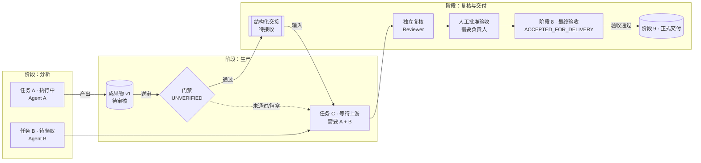

# 多 Agent 任务流程可视化设计

> 文档状态：前端体验与技术设计 v1
>
> 原始设计日期：2026-09-30
>
> 最近实现对账：2026-10-02；当前页面设计仍未等同于前端已上线能力
>
> 适用范围：项目工作区、工作流运行、团队协作、任务/Run/成果物/交接/审核/门禁的统一可视化。
>
> 关联开发计划：`docs/MULTI_AGENT_COLLABORATION_DEVELOPMENT_PLAN.md`。
>
> 现有基础：`apps/api/app/project_team.py`、`apps/web/components/project-team.tsx`、`apps/web/lib/task-flow.ts`、`apps/web/app/timeline/page.tsx`、`apps/web/app/runs/page.tsx`、`apps/web/package.json` 中已有 `@antv/g6` / `@antv/graphin`。
>
> 实现对账基线：主计划 `MULTI_AGENT_COLLABORATION_DEVELOPMENT_PLAN.md` §4.0。

---

## 0. 当前可消费实现基线

本设计不是把后端能力清单重新写成前端已上线页面。按 2026-10-02 对账结果，流程图可以直接消费或复用以下事实来源：

| 已具备能力 | 当前证据 | 流程图可消费的事实 |
|---|---|---|
| schema v1、版本化运行和节点物化 | `apps/api/app/workflow_service.py`、迁移 036/037 | workflow version、节点、依赖、输入输出和运行绑定 |
| 推进器 v1、Gate、重试和账本 | `apps/api/app/workflow_engine.py`、`workflow_gate.py`、`test_workflow_engine.py` | 节点状态、Gate 结果、重试次数、停滞和交付记录 |
| CUMCM/长文内置包 | `builtin_workflows.py`、`competition_workflow_adapter.py` | 已注册工作流包与阶段/角色形状 |
| receipt 溯源和生产路径 | `RECEIPT_FORMAT.md`、`test_artifact_receipt.py`、`project_production_path` | 产物来源、工具调用、hash、版本和下游引用 |
| 真实双 Agent 33 项 E2E 基线 | `scripts/verify_multi_agent_e2e.py`、`multi_agent_assertions.py` | 并行协作、失败重试、退回新版本、人工批准和事件追溯的回归样本 |
| 预览、dry-run、反向保存草稿 | `workflow_service.py`、`test_workflow_preview_draft.py` | 预览图、非真实执行标记和草稿起点 |

仍属于本设计和后续接线范围：统一 workflow-view DTO、流程图组件、主动信息请求/可行性异议节点、事件增量合并和完整阶段 8/9 交付视图。已有后端能力不能被前端重新解释为另一套状态源。

---

## 1. 为什么要做流程可视化

当前平台已经能展示：

- 任务列表和任务状态；
- Agent 团队成员、在线状态和当前任务；
- 成果物来源、版本、审核和下游引用；
- Run 列表和过程事件；
- 项目事件时间线；
- 任务能否执行以及阻塞原因。

但这些信息仍然分散在列表、指标卡、生产路径文本和时间线中。用户需要自己在多个页面之间拼接因果关系，无法快速回答：

1. 谁正在做什么？
2. 哪些任务可以并行？
3. 当前任务依赖哪些上游？
4. 哪份成果物通过了哪次交接和审核？
5. 哪些下游任务正在等待？
6. 失败后是重试、返工、等待人工还是终止？
7. 当前最早可行动的下一步是什么？
8. 阶段 8 为什么可以通过最终验收，阶段 9 是否已经正式交付？

因此，流程图的目标不是装饰，也不是再做一个进度条，而是把项目的**生产因果链**直接呈现出来：

```text
目标
  ↓
阶段
  ↓
任务与 Run
  ↓
成果物与版本
  ↓
交接与审核
  ↓
门禁与依赖
  ↓
阶段 8 最终验收
  ↓
阶段 9 正式交付与后续交接
```

### 1.1 体验原则

- **事实优先**：节点和边必须来自服务端权威任务、成果物、交接、Review、Gate 和事件；不根据百分比猜流程。
- **因果优先**：显示“为什么等待、等待谁、缺什么”，而不是只显示“未完成”。
- **状态分层**：任务完成、Run 完成、成果物上传、成果物批准、交接接收和最终交付不能压成一个状态。
- **动作可解释**：每个阻塞节点最多给出一个最优先的下一步；不提供不能真正启动任务的假按钮。
- **实时但不伪实时**：有 SSE/WS 就增量更新，没有实时通道时明确显示同步状态并轮询兜底。
- **图不是唯一通道**：必须保留列表、时间线、键盘访问和移动端线性降级。
- **空白零容忍**：画布应按内容自适应，避免页面高度被网格拉伸；长流程使用横向滚动或缩放，不把节点缩到不可读。

---

## 2. 核心视图：项目生产流程图

### 2.1 推荐形态：阶段泳道 + DAG + 语义边

采用混合布局：

- **横向**表示依赖和生产推进方向；
- **纵向**按工作流 stage 分泳道；
- **任务**是主要执行节点；
- **成果物**是任务输出后的文档节点；
- **交接**是带方向的传递关系，可作为边标签或中间节点；
- **Review/Gate** 是审核和门禁节点；
- **人工介入**是独立的人形/盾牌节点；
- **并行分支**在同一阶段横向并列；
- **汇聚节点**显示“等待 2/3 个上游”等明确条件。

建议流程方向：

```text
左：目标与输入
→ 中：阶段、任务、Run、成果物
→ 右：审核、交接、下游和交付
```

### 2.2 Mermaid 结构示意

以下只是设计示意，不是静态产品数据；实际图必须使用 workflow-view API 的真实节点和边。



### 2.3 节点类型

| 节点类型 | 表示对象 | 核心字段 | 用户要看懂的内容 |
|---|---|---|---|
| Goal | 项目目标/工作流输入 | title、goal、input count | 本次生产要达成什么 |
| Task | Task/Node 实例 | title、stage、status、assignee、mode | 谁做、做什么、现在在哪一步 |
| Run | 一次执行 | run_id、agent、stop_reason、usage | 这次运行是否真实执行、如何结束 |
| Artifact | 成果物版本 | name、type、version、status、hash | 产出了什么、是否可下游使用 |
| Handoff | 正式交接 | sender、receiver、receipt_status、revision | 交给谁、对方是否接收、是否被退回 |
| Review | 复核结论 | reviewer、conclusion、findings | 谁审过、结论是什么 |
| Gate | 确定性门禁 | verdict、leaves、unchecked | 为什么允许或阻挡下游 |
| Human | 人工介入点 | required_action、deadline | 需要用户做什么 |
| InformationRequest | 运行时主动信息请求 | requester、provider、request_type、blocking、deadline、status | 谁正在向谁请求什么信息，是否阻塞当前任务 |
| FeasibilityConcern | 可行性异议/不可行性报告 | concern_type、basis、impact、recommendation、can_continue_safely | Agent 为什么质疑前提，谁需要做决策，能否安全继续 |
| Delivery | 正式交付包与交付回执 | artifact set、approval、adapter、receipt | 阶段 8 是否通过、阶段 9 是否已交付 |

### 2.4 边类型

边必须有语义，不能只画一条无说明的线。

| 边类型 | 含义 | 推荐样式 | 示例 |
|---|---|---|---|
| dependency | 任务依赖任务 | 实线箭头 | B 完成后 C 才 ready |
| artifact_output | 任务产出成果物 | 蓝色实线箭头 | A → outline.md v1 |
| artifact_input | 成果物喂给下游 | 蓝色虚线箭头 | outline.md → draft |
| handoff | 正式交接 | 紫色双向/带回执标签 | A → B，待接收 |
| review | 送审关系 | 琥珀色箭头 | artifact → reviewer |
| gate_block | 门禁阻塞 | 红色虚线箭头 | gate → blocked task |
| retry | 失败后重新尝试 | 红色回环 | Run 1 failed → attempt 2 |
| revision | 退回后新版本 | 橙色箭头 | artifact v1 rejected → v2 |
| escalation | 升级人工 | 紫色虚线箭头 | stalled → owner |
| information_request | 运行时信息请求 | 青色虚线箭头 | C → A，请求上下文/事实/决策 |
| information_response | 信息回复 | 青色实线箭头 | A → C，附带事实、成果物或证据 |
| runtime_dependency | 临时运行时依赖 | 琥珀色虚线箭头 | C 等待 A 的回复后继续 |
| feasibility_concern | 可行性异议 | 红紫色虚线箭头 | Agent → Orchestrator，质疑前提或目标 |

线型、颜色和标签必须同时表达语义，不能只依赖颜色。运行时请求边不能伪装成预设 DAG 依赖；必须显示“临时依赖”、请求状态和截止时间。

---

## 3. 节点内容和状态展示

### 3.1 任务节点卡片

任务节点在默认缩放下至少显示：

```text
任务标题
阶段 · 当前状态
Agent / 成员
输入 2 · 输出 1
下一步：等待成果批准 / 可领取 / 执行中
```

节点展开后显示：

- 任务描述和目标；
- mode：manual / hybrid / auto；
- 当前 Agent、成员和 lease；
- 当前 Run、attempt、stop_reason；
- 依赖节点和依赖满足数；
- 输入成果物和版本；
- 输出成果物和审核状态；
- Gate 叶子结果：`HOLDS / NOT_HOLDS / UNVERIFIED`；
- blocker、风险和开放问题；
- 最近事件；
- 当前主动信息请求：请求谁、请求什么、是否阻塞、截止时间、回复状态；
- 当前可行性判断：是否可以安全继续、质疑哪条前提、影响哪些下游、建议谁决策；
- 唯一优先下一步。

### 3.2 状态视觉映射

状态映射必须统一，但不能把不同领域的状态混成一套业务状态。

| 视觉语义 | 使用状态 | 用户看到的解释 |
|---|---|---|
| 绿色 | APPROVED、ACCEPTED、PASSED、completed | 已通过该层条件 |
| 蓝色 | CLAIMED、RUNNING、leased | 正在执行或已被 Agent 领取 |
| 琥珀 | WAITING_REVIEW、PENDING、waiting、syncing、information_requested | 等待审核、输入、接收、主动请求回复或同步 |
| 红色 | FAILED、REJECTED、BLOCKED、NOT_HOLDS、cannot_continue | 失败、退回、明确阻塞或不能安全继续 |
| 灰色 | DRAFT、PENDING、unknown、未开始 | 尚未开始或没有足够事实 |
| 紫色 | needs_decision、approval_required、escalated | 需要人工决定或升级 |
| 斜线/问号 | UNVERIFIED | 证据不足，不能按成功处理 |

特殊状态必须有文字说明：

- `UNVERIFIED`：证据还不能证明通过；
- `goal_not_met_yet`：目标尚未达成，但仍允许有限续跑；
- `capability_unavailable`：没有授权能力，不能用“能力豁免”绕过；
- `stalled_no_progress`：连续产出没有可见变化，需要重规划或人工处理；
- `information_requested`：Agent 正在等待另一个 Agent、平台或人工提供信息；
- `feasibility_concern`：Agent 已提交可行性异议，不能把当前执行显示为正常完成；
- `unsafe_to_continue`：继续执行会依赖未经确认的假设或产生不可接受风险；
- `impossible_goal`：当前目标在已知约束下不可完成，等待 Orchestrator 决定改目标、重规划或终止。

### 3.3 进度不再只用百分比

项目顶部可以保留一个摘要，但摘要必须是事实计数而不是伪造的百分比：

```text
3 个任务已批准 · 1 个执行中 · 2 个等待上游 · 1 个待人工审核 · 0 个未解释失败
```

建议同时提供四个焦点指标：

1. **当前进行中**：正在执行的 Run 和 Agent；
2. **最早可行动**：第一个已经满足依赖、能力和执行体条件的节点；
3. **当前阻塞**：阻塞原因和影响的下游数量；
4. **交付可信度**：待审核成果、未验证 Gate、未接收交接和剩余风险。

这些指标不能替代流程图，只为用户快速定位视图焦点。

---

## 4. 交互设计

### 4.1 点击节点：右侧详情抽屉

点击任务、成果物、交接、Gate 或人工节点，打开右侧详情抽屉，不离开流程图上下文。

抽屉结构：

1. **当前状态**：机器状态 + 用户可读解释；
2. **为什么在这里**：上游依赖、当前 Gate、接收情况；
3. **谁负责**：Agent、成员、设备、能力、在线和 lease；
4. **输入/输出**：成果物名称、版本、状态、hash、来源 Run；
5. **通信记录**：报告、交接、ACK、Review、Gate 和事件；
6. **阻塞/风险**：缺什么、谁可以处理、是否可自动重试；
7. **下一步动作**：只显示权限允许且真实有效的动作；
8. **原始证据**：receipt、测试命令、事件序号和时间线链接。

### 4.2 点击边：解释依赖因果

点击边显示一个轻量说明卡：

- 边类型；
- 上游对象和下游对象；
- 创建原因；
- 源成果版本和审批状态；
- 交接是否已接收；
- 如果阻塞，阻塞从哪里开始；
- 相关事件和证据链接。

例如：

```text
这是“成果物输入”边
来源：模型规格 v2
状态：已批准，可下游使用
被任务：代码实现引用
```

### 4.3 阻塞优先模式

提供“只看阻塞链”按钮，自动突出：

```text
第一个阻塞节点
  → 阻塞原因
  → 受影响的下游任务
  → 唯一可执行的解决动作
```

示例：

```text
成果物「模型规格 v1」待审核
  → 代码实现、实验任务均等待它
  → 下一步：去审核门禁给出结论
```

不得给出“开始任务”这类不能真正触发拉取式 Agent 执行的按钮；应该给真实动作，例如“去审核”“接入 Agent”“设置执行方式”“查看缺失证据”。

### 4.4 过滤和聚焦

支持以下过滤：

- 按阶段；
- 按任务状态；
- 按 Agent/成员；
- 按事件族；
- 只看阻塞；
- 只看待人工；
- 只看未批准输入；
- 只看当前用户负责；
- 只看最近发生变化的节点。

提供“当前焦点”模式：

1. 优先聚焦最早可行动节点；
2. 若无可行动节点，聚焦最短阻塞链；
3. 若存在运行中节点，聚焦最近有事件的 Run；
4. 若阶段 8 已通过，聚焦阶段 9 的交付适配器、交付回执和残余风险；若阶段 9 也完成，则聚焦正式交付包和后续交接。

### 4.5 和时间线、列表联动

- 在时间线点击事件，流程图定位并高亮对应节点；
- 在流程图点击节点，可跳到该节点事件过滤后的时间线；
- 任务列表和流程图共享选中节点；
- 成果物详情中的“查看它的事件”继续可用；
- Run 详情中的过程事件在流程图节点内显示摘要；
- 不重复维护一套前端状态，选中状态通过 workspace 页面上下文传递。

### 4.6 运行时主动协作与诚实汇报

流程图必须让用户看见 Agent 在执行过程中主动发现问题、向谁求助、得到什么回复，以及发现无法安全完成后如何上报；不能只在任务结束时显示一个失败状态。

#### 场景一：主动请求信息并继续

```text
Agent C 执行中
  → 发现缺少信息
  → 发起 information_request
  → 平台路由给 Agent A / Agent B / 人工负责人
  → 请求状态：已发送 / 已接收 / 已回复
  → 回复附带事实、成果物版本或证据
  → C 消费回复并继续 Run
```

节点和边的显示要求：

- C 节点显示“主动请求信息”，并显示请求类型、接收方、`required/optional/conditional`、截止时间和当前回复状态；
- C 与被请求方之间显示 `information_request` 或 `runtime_dependency` 边，明确它不是原始 DAG 依赖；
- 收到回复但 C 尚未确认消费时，显示“回复已到达，等待 C 确认”，不能显示“已解除阻塞”；
- C 确认消费后，显示请求使用的证据、Artifact 版本和继续执行事件；
- 如果回复是 `provisional`，节点继续显示风险标记，不能显示为已获得确定性输入。

#### 场景二：质疑前提、无法完成或诚实升级

```text
Agent C 执行中
  → 发现输入/目标/资源/验收前提不成立
  → 提交 feasibility_concern
  → 节点显示：等待编排决策
  → Orchestrator 选择：补充信息 / 改任务 / 换 Agent / 重规划 / 人工升级 / 终止
  → 流程图保留原始判断、证据、影响范围和决策理由
```

用户必须能够区分：

- `at_risk`：仍可安全继续，但存在已记录风险；
- `waiting_for_decision`：Agent 已提出异议，等待 Orchestrator 或人工决策；
- `cannot_continue`：继续执行不安全，节点已暂停或阻塞；
- `honest_stop`：已确认当前目标不可行，系统如实结束当前节点/Run；
- `replanned`：原计划没有被偷偷修改，而是产生了有版本、有依据的新决策。

详情抽屉要显示：

1. Agent 的原始判断和提交时间；
2. 已验证事实与未验证假设分栏；
3. 证据、receipt、测试和相关请求；
4. 影响的当前节点、下游节点和交付条件；
5. Orchestrator 的决策、决策依据和下一步；
6. 如果继续执行，显示使用的假设、责任人、有效期和回滚条件；
7. 如果终止，显示 `stop_reason` 和后续建议，而不是泛化成“系统错误”。

禁止：

- 把 Agent 的请求自动显示成任务失败；
- 把 Agent 的风险意见自动显示成最终事实；
- 把 Orchestrator 尚未处理的异议显示成“已解决”；
- 用绿色完成覆盖 `information_requested`、`feasibility_concern`、`cannot_continue` 或 `honest_stop`。

---

## 5. 数据契约与后端依赖

### 5.1 推荐 workflow-view DTO

流程图不应在浏览器端拼接多个不一致接口。建议提供项目级聚合端点，例如：

```text
GET /api/projects/{project_id}/workflow-view
```

初始返回结构：

```json
{
  "project_id": "project_...",
  "workflow": {
    "key": "longform-writing",
    "version_id": "workflow_version_...",
    "name": "长文写作",
    "state": "running"
  },
  "generated_at": "2026-09-30T12:00:00Z",
  "cursor": {"stream": "project:...", "last_seq": 42},
  "summary": {
    "total_nodes": 8,
    "running": 1,
    "ready": 2,
    "waiting": 2,
    "blocked": 1,
    "approved": 2,
    "unverified": 1
  },
  "stages": [
    {"id": "analysis", "title": "分析", "order": 1}
  ],
  "nodes": [
    {
      "id": "node_run_outline",
      "kind": "task",
      "stage_id": "analysis",
      "task_id": "task_...",
      "run_id": "run_...",
      "title": "写大纲",
      "status": "RUNNING",
      "status_label": "执行中",
      "assignee": {"type": "agent", "id": "agent_a", "name": "分析 Agent"},
      "attempt": 1,
      "inputs": [],
      "outputs": ["artifact_..."],
      "blockers": [],
      "next_action": null,
      "last_event_seq": 41
    }
  ],
  "edges": [
    {
      "id": "edge_...",
      "kind": "artifact_input",
      "source": "artifact_...",
      "target": "node_run_draft",
      "label": "模型规格 v2",
      "status": "accepted",
      "reason": "已批准且允许下游引用"
    }
  ],
  "runtime_requests": [
    {
      "id": "request_...",
      "kind": "information_request",
      "requester_node_id": "node_run_code",
      "requester_agent_id": "agent_c",
      "provider_agent_id": "agent_a",
      "request_type": "context",
      "question": "请确认当前模型约束和可用输入",
      "blocking": "required",
      "status": "ACKNOWLEDGED",
      "response_deadline": "2026-09-30T13:00:00Z",
      "correlation_id": "corr_...",
      "evidence_refs": []
    }
  ],
  "feasibility_concerns": [
    {
      "id": "concern_...",
      "node_id": "node_run_code",
      "type": "invalid_assumption",
      "status": "needs_decision",
      "claim": "当前输入不足以安全完成任务",
      "can_continue_safely": false,
      "recommendation": "request_information",
      "affected_node_ids": ["node_run_code", "node_run_experiment"]
    }
  ],
  "blocking_chains": [
    {
      "root_node_id": "node_gate_...",
      "reason": "成果物待审核",
      "affected_node_ids": ["node_run_code", "node_run_experiment"]
    },
    {
      "root_node_id": "node_run_code",
      "reason": "等待 Agent A 回复运行时信息请求",
      "request_id": "request_...",
      "affected_node_ids": ["node_run_code"]
    }
  ]
}
```

### 5.2 DTO 原则

- `nodes` 和 `edges` 来自服务端权威对象；
- `status_label` 可以由服务端提供，但前端仍需按统一词典兜底；
- `next_action` 只代表建议，不替代权限检查；
- `last_event_seq` 用于节点级增量更新和排序；
- `cursor` 用于 SSE 断线重连；
- `blocking_chains` 应由服务端根据依赖、Gate、成果物和运行时请求状态计算，前端不自行猜完整阻塞链；
- `runtime_requests` 是临时运行时事实，不修改已发布 workflow version；请求的 `blocking`、`status`、截止时间和证据必须可见；
- `feasibility_concerns` 必须保留 Agent 的原始判断、证据、是否可安全继续和 Orchestrator 决策，不得只显示一个红色失败点；
- 已批准成果物的版本必须保留，不能只返回最新名称；
- 未知节点类型和未知边类型，前端显示通用节点/边并继续渲染。

### 5.3 复用和扩展现有数据

优先复用：

- `project_team.py`：Agent、能力、在线、当前任务、待接收交接；
- `project_production_path`：成果物来源、版本、交接、下游任务；
- `task-flow.ts`：依赖、执行体、Agent 和审核阻塞诊断；
- `AGENT_EVENT_CONTRACT.md`：事件目录、seq、SSE、未知事件忽略；
- `acceptance.py`：Gate 叶子结果；
- `progress_ledger.py`：停滞和下一步决策摘要。

不应让前端自行复制后端状态机逻辑；`task-flow.ts` 只作为立即可用性提示和前端体验层，真正的状态迁移和流程推进仍由服务端决定。

---

## 6. 实时更新和可靠性

### 6.1 初始加载

1. 页面加载时请求 workflow-view 聚合；
2. 保存返回的 `cursor.last_seq`；
3. 根据 `stages/nodes/edges` 渲染完整图；
4. 如果项目没有工作流或没有任务，显示真实空态，不生成示例节点。

### 6.2 增量事件

前端消费已注册的 `project.*` 事件：

- `project.task.*` 更新任务节点；
- `project.run.*` 更新 Run 状态和执行摘要；
- `project.artifact.*` 更新成果物版本、审核和上下游边；
- `project.handoff.*` 更新交接边和接收状态；
- `project.review.*` 更新 Review 节点；
- `project.gate.*` 更新门禁节点和阻塞链；
- `project.agent.*` 更新在线、能力和租约展示；
- `project.information_request.*` 更新主动请求、回复、转问、过期和临时依赖；
- `project.feasibility_concern.*` 更新可行性异议、争议、Orchestrator 决策和诚实终止。

事件处理规则：

1. 按 `seq` 去重；
2. 只接受比当前游标新的事件；
3. 不能根据一条孤立事件删除未知节点；
4. 新事件的对象不存在时，标记“正在同步”，回读 workflow-view；
5. 信息请求收到回复但请求方节点尚未同步时，暂显示“回复已到达，正在同步消费方状态”，不能直接把节点标成可继续；
6. 可行性异议到达时，保留原节点和证据，显示“等待编排决策”，不能直接把节点标成失败或完成；
7. 未知事件和未知 payload 字段忽略，不阻断整个画布。

### 6.3 断线、gap 和兜底

```text
正常：SSE/WS 增量 → 本地合并
断线：after=<last_seq> 重连
发生 gap：回读 durable event 或 workflow-view
实时通道不可用：5 秒轮询 workflow-view
恢复成功：更新 cursor，清除“正在同步”提示
```

不能：

- 用本地计时器把节点自动改成完成；
- 收到 `run.finished` 就直接把成果标成 approved；
- 收到未知事件就清空流程图；
- 把轮询和 SSE 的同一事件重复累加。

### 6.4 连接状态展示

流程图顶部显示轻量连接状态：

- `实时同步`：增量连接正常；
- `正在重连`：连接断开，保留当前已知事实；
- `正在补齐历史`：出现 gap，正在回读持久事件；
- `轮询兜底`：实时通道不可用；
- `数据可能滞后`：无法确认最新状态。

“正在重连”期间不能把未知变成失败，也不能把已运行变成已完成。

---

## 7. 技术实现建议

### 7.1 组件和文件

建议新增：

```text
apps/web/components/workflow-flow.tsx
apps/web/components/workflow-node-detail.tsx
apps/web/lib/workflow-view.ts
apps/web/lib/workflow-status.ts
```

必要时扩展：

```text
apps/web/lib/api.ts
apps/web/lib/workspace.tsx
apps/web/app/timeline/page.tsx
apps/web/components/project-team.tsx
```

后端对应新增或扩展：

```text
apps/api/app/project_workflow_view.py
apps/api/app/main.py 或现有项目路由模块
```

具体落点由 A/B 按当前路由组织确定；不应绕过现有 API 和权限层。

### 7.2 图形库选择

优先复用项目已有的 `@antv/g6` / `@antv/graphin`，不新增图形依赖。建议：

- G6 负责 DAG 节点、边、缩放、拖拽和布局；
- React 负责详情抽屉、筛选、状态词典和动作按钮；
- workflow-view DTO 转换在 `lib/workflow-view.ts` 完成；
- G6 初始化放在 client-only 组件中，必要时用 Next dynamic import，避免静态预渲染问题；
- 第一版使用确定性 DAG 布局，避免每次刷新节点乱跳；
- 相同 `node.id` 固定位置优先于追求自动布局的绝对紧凑。

### 7.3 布局和空白纪律

- 页面根使用现有 `PAGE_GRID`，内容按自然高度靠上；
- 流程图容器使用 `FILL_COLUMN` 时，内部明确 `min-height: 0`；
- 画布外层固定可控高度并允许横向/纵向滚动；
- 不把整个页面设成强制满高，避免面板内部出现大面积空白；
- 面板中同时放图和列表时，列表应承担可访问性和窄屏降级，不用压缩图替代文字；
- 节点过多时使用阶段折叠、过滤和聚焦，而不是把所有节点无限缩小。

---

## 8. 移动端、无障碍和降级

### 8.1 移动端

小屏幕默认不显示全量超宽图，而采用：

1. 阶段折叠列表；
2. 当前阶段横向可滚动画布；
3. 当前节点详情抽屉；
4. “上一节点 / 下一节点 / 上游 / 下游”导航；
5. 完整线性列表作为图形不可用时的等价信息。

不能把桌面端 1200px 画布简单缩到 320px 后仍要求用户阅读节点文字。

### 8.2 无障碍

- 节点颜色必须配文字、图标、状态标签；
- 每个节点有 `aria-label`，包含标题、阶段、状态和下一步；
- 边的重要语义同时在详情和线性列表中表达；
- 键盘可以从阶段、节点、边详情顺序浏览；
- 动画只表示新事件或选中变化，不持续闪烁表示“执行中”；
- 提供“切换为列表视图”按钮。

### 8.3 空态和异常态

- 无工作流：说明“当前项目没有绑定工作流”，提供真实入口；
- 有工作流无任务：说明“已生成骨架，尚未开始执行”；
- 无在线 Agent：显示“等待 Agent 接入”，不要显示执行中；
- 有任务无成果物：显示“任务尚未产生可读取成果”，不要生成虚拟文档节点；
- 数据同步失败：保留最后一次可信图，标记数据可能滞后；
- 只有历史数据：显示历史时间和“当前没有在运行”，不把历史 Run 当在线执行；
- 有未处理可行性异议：显示“等待编排决策”，保留原始证据，不显示虚假的失败或完成；
- 有过期信息请求：显示请求对象、超时原因和下一步转问/升级策略，不静默移除临时依赖。

---

## 9. 分期实施与验收

### V1：只读生产流程图

范围：

- workflow-view 聚合 DTO；
- 阶段泳道、Task/Artifact/Handoff/Gate/InformationRequest/FeasibilityConcern 节点；
- dependency/artifact/handoff/review/gate/information_request/feasibility_concern 边；
- 节点详情抽屉；
- 阶段、状态、Agent、阻塞筛选；
- 流程图/列表切换；
- 空态、错误态、移动端降级。

验收：

- 真实项目流程图与任务列表、生产路径、时间线一致；
- 用户能看懂并行、依赖、交接、审核和阻塞；
- 用户能看懂“谁向谁请求什么信息、是否阻塞、回复是否已消费”；
- 用户能看懂 Agent 为什么质疑原计划、影响哪些下游、当前等待谁决策；
- 不显示不存在的任务、成果物或 Agent。

### V2：实时和恢复

范围：

- SSE/WS `project.*` 事件增量更新；
- seq 去重和 cursor；
- 断线重连和 gap 回读；
- 连接状态提示；
- 时间线与流程图联动；
- 主动请求状态增量和回复消费状态；
- 可行性异议、争议和诚实终止的增量展示；
- 阻塞链聚焦。

验收：

- 断线期间不误报完成；
- 恢复后不重复渲染或丢失事件；
- 未知事件不会使流程图崩溃。

### V3：真实用户动作

范围：

- 审核成果物；
- 接收/退回交接；
- 重试失败节点；
- 解除阻塞；
- 请求人工输入；
- 查看和复制证据。

所有动作必须复用已有权限和审批 API，不在前端新增状态协议。

验收：

- 每个动作产生服务端事实事件；
- 操作完成后图、列表、时间线一致；
- 非法动作显示真实服务端原因。

### V4：工作流预览和自定义编排

已具备的后端基础：

- 模板结构预览和 dry-run 已交付：只展开任务图，不创建真实任务、运行或事件；
- 从成功项目反向保存 workflow 草稿已交付：草稿需经编辑器补全和服务端校验，不能直接视为已发布模板；
- 证据：`apps/api/app/workflow_service.py`、`apps/api/test_workflow_preview_draft.py`、提交 `0676937`。

仍需实现的前端/发布能力：

- 模板结构预览图；
- 结构化编辑器；
- 版本发布、复制、比较和历史运行绑定界面；
- 权限动作、审计和 schema 错误逐条展示。

硬约束：

- 预览、模板骨架和 dry-run 不得标记为真实完成；
- 历史运行不能因模板修改而改变解释；
- 用户编辑器只能生成通过服务端 schema 校验的定义。

### 9.1 真实多 Agent 验收场景

流程图必须能展示以下完整过程：

```text
Agent A 与 Agent B 并行
→ A 产出成果物 v1
→ v1 待审核
→ 交接发送给 B，等待接收
→ Gate/Review 通过
→ B 读取批准输入继续
→ 一个 Run 失败并重试
→ 一个成果被退回并生成 v2
→ 复核 Agent 给出结论
→ 阶段 8：人工批准最终验收
→ 阶段 9：交付适配器生成正式交付包并记录回执
```

其中，33 项既有真实双 Agent E2E 已覆盖：双 Agent/设备令牌、领取、receipt、失败重试、成果退回新版本、人工批准、团队/生产聚合和事件追溯。以下是本轮新增验收，不得假设已有覆盖：

- Agent C 主动向 Agent A/B 请求信息，收到可消费回复后继续当前 Run；
- Agent 提交 `feasibility_concern` 后由 Orchestrator 决策、升级或诚实终止；
- 阶段 8 `ACCEPTED_FOR_DELIVERY` 与阶段 9 `DELIVERED` 分离，`DELIVERY_FAILED` 不回写验收结论；
- 断线、gap、重启、重复回复、过期接管和流程图恢复后仍与持久化事实一致。

最终检查：

- 并行分支真实存在；
- 依赖边和成果输入边方向正确；
- 交接有发送与接收状态；
- Gate 的 `UNVERIFIED` 不显示绿色；
- 失败、重试、退回和新版本可追溯；
- 阶段 8 只有在全部验收条件满足后显示 `ACCEPTED_FOR_DELIVERY`；
- 阶段 9 只有在交付适配器成功并有交付回执后显示 `DELIVERED`；
- 交付失败显示独立的 `DELIVERY_FAILED`，不回写阶段 8 的验收结论；
- 刷新、断线和恢复后图仍与持久化事实一致。
